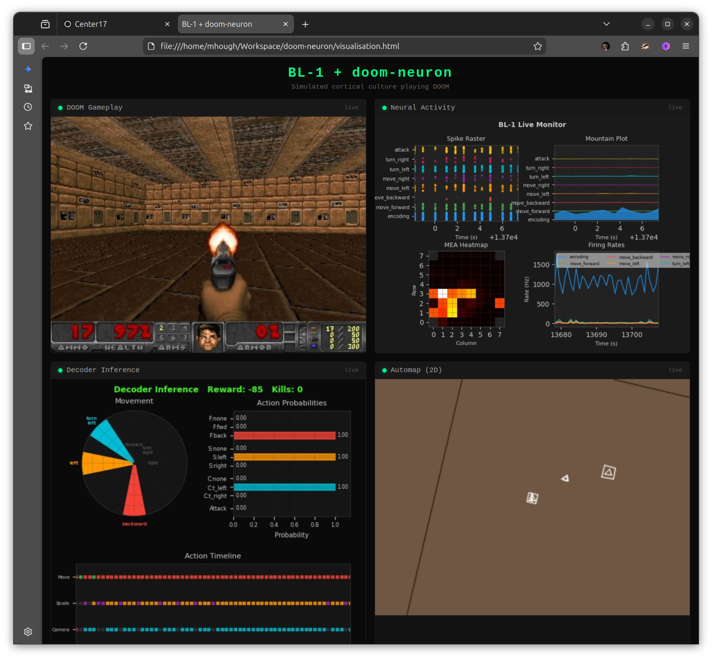

# BL-1: In-Silico Cortical Culture Simulator


BL-1 is a JAX-based framework for simulating dissociated cortical cultures growing on multi-electrode arrays (MEAs). It combines biologically detailed spiking neuron models with conductance-based synapses, four timescales of synaptic plasticity, virtual MEA recording and stimulation, and closed-loop game experiments -- all within a fully differentiable, JIT-compiled simulation loop built on `jax.lax.scan`. BL-1 enables researchers to run in-silico replications of biological intelligence experiments at scale, with GPU acceleration and support for gradient-based optimization through surrogate gradients. The closed-loop game module replicates the DishBrain experiment (Kagan et al. 2022), which grew biological cortical neurons on HD-MEAs and demonstrated that living neural cultures could learn to play Pong via free-energy-principle feedback.

---

## Key Features

### Neuron Models
- **Izhikevich** (2003) -- five cortical cell types: Regular Spiking (RS), Intrinsically Bursting (IB), Chattering (CH), Fast Spiking (FS), Low-Threshold Spiking (LTS)
- **Adaptive Exponential (AdEx)** integrate-and-fire model
- **Hybrid populations** mixing Izhikevich and AdEx neurons
- **Jaxley adapter** for morphologically detailed compartmental neurons (optional)

### Conductance-Based Synapses
- **AMPA** -- fast excitatory (tau = 2 ms)
- **NMDA** -- slow excitatory with Mg2+ voltage-dependent block (dual-exponential kinetics)
- **GABA_A** -- fast inhibitory (tau = 6 ms)
- **GABA_B** -- slow inhibitory (dual-exponential kinetics)

### Plasticity (4 Timescales)
- **Short-term plasticity (STP)** -- Tsodyks-Markram depression and facilitation
- **Spike-timing-dependent plasticity (STDP)** -- asymmetric Hebbian learning with configurable time constants
- **Homeostatic scaling** -- firing-rate-based synaptic weight normalization
- **Structural plasticity** -- activity-dependent synapse creation and pruning

### Virtual MEA
- **CL1 64-channel** -- 8x8 grid, 200 um spacing (standard configuration)
- **MaxOne HD-MEA** -- 26,400 electrodes, 17.5 um spacing (high-density mode with sparse indexing)
- Spike detection, LFP approximation, and electrical stimulation
- Configurable detection and activation radii

### Game Environments
- **Pong** -- closed-loop paddle game replicating the biological DishBrain experiment (Kagan et al. 2022) with FEP feedback
- **Doom** -- ViZDoom integration for 3D environments (optional `vizdoom` extra)
- Three feedback modes: Free Energy Principle (`fep`), `open_loop`, `silent`

### Analysis Toolkit
- **Criticality** -- branching ratio, neuronal avalanche size distributions
- **Burst detection** -- network burst identification, inter-burst intervals, recruitment statistics
- **Functional connectivity** -- cross-correlation, transfer entropy, small-world and rich-club coefficients
- **Information theory** -- active information storage, mutual information, integration, complexity
- **Pharmacology** -- drug effect modelling (TTX, Carbamazepine, Bicuculline, APV, CNQX)
- **Sensitivity analysis** -- parameter sweeps, fitting, firing rate and synchrony metrics

### Visualization
- Spike raster plots with E/I coloring
- Population firing rate traces
- MEA heatmaps and activity plots
- Avalanche distribution plots
- Burst overlays and ISI distributions

### Performance
- Entire simulation loop JIT-compiled via `jax.lax.scan` -- zero Python overhead
- Sparse connectivity with JAX BCOO and event-driven operations
- Fast sparse path with `segment_sum` for 50K+ neuron networks
- Pallas custom kernels for CSC event-driven synaptic input (GPU)
- GPU-ready: **5.3x realtime at 10K neurons on A100**
- Differentiable through surrogate gradients (SuperSpike, sigmoid, arctan)

---

## Simulated Neurons Playing DOOM

BL-1 integrates with [doom-neuron](https://github.com/SeanCole02/doom-neuron) to create an in-silico replication of the biological DishBrain DOOM experiment. BL-1's virtual CL1 server replaces the real Cortical Labs hardware with 10,000 biophysically grounded spiking neurons -- speaking the exact same UDP protocol -- so the PPO training system connects without modification.



**Live 4-panel dashboard** showing the closed-loop system in real-time:
- **DOOM Gameplay** -- first-person view from VizDoom
- **Neural Activity** -- spike raster, mountain plot, MEA heatmap, and firing rate timeseries from the simulated culture (RatInABox-inspired composable monitoring)
- **Decoder Inference** -- action probability compass and per-head bar chart showing what the ML decoder infers from the neural spikes
- **Automap (2D)** -- retro Atari-style top-down map view with pixelated rendering

### How It Works

```
DOOM Game State ─► Encoder (PyTorch) ─► Stimulation frequencies/amplitudes
                                              │
                                    UDP :12345 (72 bytes)
                                              │
                                              ▼
                               BL-1 Virtual CL1 (JAX)
                            10,000 Izhikevich neurons
                            AMPA/NMDA/GABA synapses + STP
                            64-channel virtual MEA
                                              │
                                    UDP :12346 (40 bytes)
                                              │
Reward ◄── DOOM executes ◄── Decoder (PyTorch) ◄── Spike counts per channel
```

The encoder learns stimulation patterns via REINFORCE (non-differentiable spikes). The decoder maps 8 channel-group spike counts to movement, camera, and attack actions. Feedback stimulation rewards kills and punishes damage, scaled by TD-error surprise.

### Why BL-1 Instead of Random Spikes

doom-neuron's SDK mode generates random spikes. BL-1 provides neurons that actually respond to stimulation with structured dynamics -- validated against Wagenaar et al. (2006) cortical culture recordings. Ablation tests (`--decoder-ablation zero`) confirm the simulated neurons carry meaningful signal.

### Quick Start

```bash
# Clone both repos
git clone https://github.com/lau-sam/bl1.git
git clone https://github.com/SeanCole02/doom-neuron.git

# Shared venv
uv venv .venv --python 3.12 && source .venv/bin/activate
uv pip install -e "./bl1[vizdoom,dev]"
uv pip install torch torchvision --index-url https://download.pytorch.org/whl/cpu
uv pip install tensorboard==2.20.0 tables opencv-python

# Launch (BL-1 virtual CL1 + doom-neuron training)
./run_bl1_doom.sh

# Open dashboard in browser
# doom-neuron/visualisation.html
```

See [INTEGRATION.md](../INTEGRATION.md) for full documentation.

### Live Monitoring Module (`bl1.monitor`)

A RatInABox-inspired monitoring system with composable plot methods:

```python
from bl1.monitor import ActivityMonitor

mon = ActivityMonitor(n_neurons=10_000)

# Composable single-panel (RatInABox pattern)
fig, ax = mon.plot_raster(window_s=10.0)
fig, ax = mon.plot_mountain(window_s=10.0)   # stacked filled-area
fig, ax = mon.plot_mea_heatmap(window_s=1.0) # 8x8 electrode grid

# Full dashboard
fig, axes = mon.plot_dashboard(window_s=10.0)

# MJPEG streaming for browser
from bl1.monitor import NeuralMJPEGServer
server = NeuralMJPEGServer(port=12350)
server.start()
server.update_frame(mon.render_frame(640, 480))
```

---

## Installation

**Fastest path — [devbox](https://www.jetify.com/devbox) + [task](https://taskfile.dev) (recommended):**

`devbox` provisions the exact toolchain (Python 3.12, Rust, `task`) in an isolated
shell — no global installs — and `task` is the single entry point for every command.

```bash
git clone https://github.com/lau-sam/bl1.git
cd bl1
devbox shell        # drops you into a shell with the full toolchain
task install        # Python venv (.venv) + Rust workspace build
task tui            # launch the interactive cockpit
task                # list every available command
```

Already have Python and Rust? Skip devbox and use `task` directly, or install
manually:

**Manual from source:**

```bash
git clone https://github.com/lau-sam/bl1.git
cd bl1
pip install -e ".[dev]"
```

**With optional extras:**

```bash
# Development tools (pytest, hypothesis, ipykernel)
pip install -e ".[dev]"

# Code quality (ruff, mypy, vulture, radon, bandit, interrogate)
pip install -e ".[quality]"

# Documentation (sphinx, RTD theme)
pip install -e ".[docs]"

# Morphological neurons via Jaxley
pip install -e ".[jaxley]"

# Doom game environment
pip install -e ".[vizdoom]"
```

**JAX GPU support:**

BL-1 uses CPU JAX by default. For GPU acceleration, install the appropriate JAX variant for your CUDA version:

```bash
pip install -U "jax[cuda12]"
```

See the [JAX installation guide](https://jax.readthedocs.io/en/latest/installation.html) for details.

---

## Quick Start

```python
import jax
import jax.numpy as jnp

from bl1 import Culture
from bl1.core import simulate, create_synapse_state
from bl1.visualization import plot_raster

# 1. Create a culture: 200 neurons on a 3x3 mm substrate
key = jax.random.PRNGKey(42)
net_params, state, izh_params = Culture.create(
    key, n_neurons=200, ei_ratio=0.8, g_exc=0.05, g_inh=0.20,
)

# 2. Prepare synapse state and external drive
n_neurons = 200
syn_state = create_synapse_state(n_neurons)
T_ms, dt = 1000.0, 0.5               # 1 second simulation
n_steps = int(T_ms / dt)

# Background noise current (keeps the culture spontaneously active)
I_ext = 5.0 * jax.random.normal(jax.random.PRNGKey(0), (n_steps, n_neurons))

# 3. Build initial neuron state from the culture state
from bl1.core import NeuronState
neuron_state = NeuronState(v=state.v, u=state.u, spikes=state.spikes)

# 4. Run simulation
result = simulate(
    izh_params, neuron_state, syn_state, stdp_state=None,
    W_exc=net_params.W_exc, W_inh=net_params.W_inh,
    I_external=I_ext, dt=dt,
)

# 5. Plot the spike raster
n_exc = int(n_neurons * 0.8)
fig = plot_raster(result.spike_history, dt_ms=dt, ei_boundary=n_exc)
fig.savefig("raster.png", dpi=150)
```

---

## Architecture

```
                        +------------------+
                        |   Closed-Loop    |  bl1.loop
                        |   Controller     |
                        +--------+---------+
                                 |
                    encode / decode / stimulate
                                 |
                  +--------------+--------------+
                  |         Virtual MEA         |  bl1.mea
                  |  (64-ch / HD-MEA / LFP)     |
                  +--------------+--------------+
                                 |
                   record spikes | inject current
                                 |
     +---------------------------+---------------------------+
     |                    Network Layer                      |  bl1.network
     |  place_neurons  |  build_connectivity  |  Culture     |
     +---------------------------+---------------------------+
                                 |
              +------------------+------------------+
              |           Plasticity Stack          |  bl1.plasticity
              |  STP  |  STDP  |  Homeostatic  |   |
              +------------------+------------------+
                                 |
         +-----------------------+-----------------------+
         |              Core Simulation                  |  bl1.core
         |  Izhikevich / AdEx neurons                    |
         |  AMPA / NMDA / GABA_A / GABA_B synapses       |
         |  simulate() via jax.lax.scan                  |
         +-----------------------------------------------+
```

**Data flow per timestep:** Neurons fire spikes. Spikes propagate through conductance-based synapses (optionally modulated by STP). STDP and homeostatic rules update weights. The MEA records spikes and injects stimulation currents. In closed-loop mode, the controller decodes motor actions from neural activity, steps the game, encodes sensory feedback, and delivers stimulation according to the selected feedback policy.

---

## Configuration

BL-1 uses YAML configuration files to define experiment parameters. Three reference configs are included:

| Config | File | Description |
|--------|------|-------------|
| **Default** | `configs/default.yaml` | 100K neurons, standard Izhikevich parameters, 64-ch MEA |
| **Wagenaar Calibrated** | `configs/wagenaar_calibrated.yaml` | 5K neurons tuned to reproduce Wagenaar et al. (2006) spontaneous bursting (~8 bursts/min, IBI ~9s) |
| **DishBrain Pong** | `configs/dishbrain_pong.yaml` | In-silico replication of the biological DishBrain Pong experiment with FEP feedback |

Load a config:

```python
import yaml

with open("configs/wagenaar_calibrated.yaml") as f:
    cfg = yaml.safe_load(f)

net_params, state, izh_params = Culture.create(
    key,
    n_neurons=cfg["culture"]["n_neurons"],
    ei_ratio=cfg["culture"]["ei_ratio"],
    lambda_um=cfg["culture"]["lambda_um"],
    p_max=cfg["culture"]["p_max"],
    g_exc=cfg["culture"]["g_exc"],
    g_inh=cfg["culture"]["g_inh"],
)
```

---

## Documentation

- **API reference:** `docs/api/` -- auto-generated Sphinx docs for all modules
- **Quick start guide:** `docs/quickstart.rst`
- **Notebooks:** `notebooks/00_quickstart.ipynb` -- interactive tutorial

Build the HTML docs locally:

```bash
make docs
# Output: docs/_build/html/index.html
```

---

## Development

BL-1 uses a [task](https://taskfile.dev)-driven workflow with [Ruff](https://docs.astral.sh/ruff/) for linting and formatting, [mypy](https://mypy-lang.org/) for type checking, and [pytest](https://pytest.org/) for testing. Run `task` with no arguments to list every command.

```bash
# Lint and format check
task lint

# Auto-fix lint issues
task lint:fix

# Type checking
task typecheck

# Run tests (excludes slow calibration tests)
task test          # Python
task test:rust     # Rust workspace
task test:all      # both

# Tests with coverage report
task coverage

# Code quality metrics (docstring coverage, dead code, complexity, security)
task quality

# All Python checks
task all

# Benchmarks (local CPU / Modal A100)
task benchmark
task benchmark:gpu
```

---

## Rust: forward simulator + terminal UI

The `rust/` directory hosts a Cargo workspace that ports the **forward** simulation to native
Rust and adds a lazygit-style terminal UI for interactive exploration. It complements the Python
package: the differentiable training pipeline stays in JAX, while the Rust core gives fast,
dependency-light simulation and a keyboard-driven control panel.

| Crate | Purpose |
|-------|---------|
| `bl1-core` | Izhikevich/AdEx neurons, AMPA/NMDA/GABA_A/GABA_B synapses, STP, STDP, CSR connectivity, integrator |
| `bl1-analysis` | Burst detection (Wagenaar), branching ratio and avalanche exponents (Beggs & Plenz, MLE) |
| `bl1-mea` | 64-channel and HD-MEA layouts, neuron→electrode mapping, spike detection, LFP |
| `bl1-sim` | Neuron placement, distance-dependent connectivity, `Culture` factory, YAML config loader |
| `bl1-games` | Closed-loop DishBrain experiments: Pong (`bl1-pong`) — sensory encoding, motor decoding, FEP feedback, online STDP |
| `bl1-tui` | The `bl1` binary: a terminal UI to run and inspect simulations |

From the repo root, `task` wraps the common commands:

```bash
task tui             # launch the terminal UI (reads configs/*.yaml)
task tui:release     # same, optimized release build
task sim             # print one preview's statistics, no TTY
task test:rust       # run the unit tests
```

Or drive Cargo directly from `rust/`:

```bash
cd rust
cargo test                 # run the unit tests
cargo run -p bl1-tui       # launch the terminal UI (reads ../configs/*.yaml)
cargo run -p bl1-tui -- --headless   # print one preview's statistics, no TTY
```

The UI is a mouse- and keyboard-driven cockpit with five views (**Dashboard**, **Simulate**,
**Train**, **Science**, **Results**), inspired by lazygit and k9s:

- **Navigate:** click a tab, or press `Tab` / `1` `2` `3` to switch views. `?` opens a
  context-sensitive help overlay for the current view; the most-used keys are always shown
  in the bar at the bottom.
- **Simulate:** click a config or use `j`/`k` to select it; adjust the neuron cap and preview
  window with the on-screen `[-]` `[+]` buttons (or `+`/`-` and `[`/`]`); `s` reseeds;
  `Enter`/`r` or the **Run** button starts a preview. The simulation runs on a background
  thread — the UI stays responsive with a live spinner while it computes. The raster scrolls
  with the mouse wheel.
- **Train:** watch the culture **learn Pong live** — press Space to start, `+`/`-` to change speed,
  `r` to reset. A Canvas renders the game (ball + tracking paddle) in real time next to a live
  hit-rate learning curve (Chart), skill gauges, and the culture's sensory bump (Sparkline). Built
  from ratatui's Canvas / Chart / Gauge / Sparkline widgets.
- **Science:** the biology metrics of the last run in plain language — firing rate, network bursts
  (vs Wagenaar 2006), branching ratio σ and avalanche exponent (criticality, Beggs & Plenz 2003) —
  each with a one-line explanation and a "matches living cortex?" verdict.
- **Results:** browse every run from the session with the metrics that came out of it; press
  `e` to export the whole session to `results/session_runs.csv`.

Per-step ordering, cell-type mixes, and receptor kinetics mirror the JAX model; the YAML loader
reads the same `configs/*.yaml` files.

### Closed-loop Pong (DishBrain)

`bl1-games` runs a simulated culture in a Pong closed loop (Kagan 2022 protocol): ball position is
encoded as sensory stimulation, two motor regions decode a paddle action, free-energy-principle
feedback marks hits/misses, and **reward-modulated STDP** (a three-factor rule, Izhikevich 2007)
consolidates the synapses whose activity led to a hit.

```bash
task pong -- --neurons 400 --steps 4000        # or: cargo run --release -p bl1-games --bin bl1-pong
```

It prints hits/misses, mean rally length, a learning-improvement score, and a hit-rate curve, and can
export a per-event CSV (`--csv path`). A multi-seed parameter sweep lives in `bl1-pong-sweep`
(`task pong-sweep`), scoring configs by their seed-averaged learning improvement.

Three agents share the loop:

- **pursuit** (`--pursuit`): the spiking culture **learns to play**. A sensory population place-codes
  the ball; a linear readout drives the paddle through a Gaussian policy trained by reward-modulated
  Hebbian learning (node perturbation / REINFORCE) with a dense tracking reward and a per-position
  baseline. It reaches **~50% hit rate (vs ~16% for a static paddle)** with a consistent upward
  learning trend across seeds. Two ingredients were essential: population averaging per band, and
  sum-1 normalisation of the feature vector (so `Δw ∝ x` stays well-scaled however sparsely the
  culture fires).
- **reflex** (default): motor read from the sensory-driven bands — tracks the ball (~40%) but has no
  plastic degrees of freedom to learn from.
- **R-STDP** (`--rstdp`): the Wunderlich-style spike-correlation recipe (plastic S→M projection,
  per-neuron graded reward, homeostasis). Correct architecture, but does not yet converge here —
  spike-correlation credit assignment is far harder than the node-perturbation gradient.

```bash
task pong -- --pursuit --steps 8000    # watch the hit rate climb
```

The culture genuinely learns closed-loop game play; making the harder spike-correlation route
(R-STDP) and realistic smooth-pursuit paddle dynamics work are open problems — **contributions
welcome.**

## License

BL-1 is released under the [MIT License](LICENSE).
